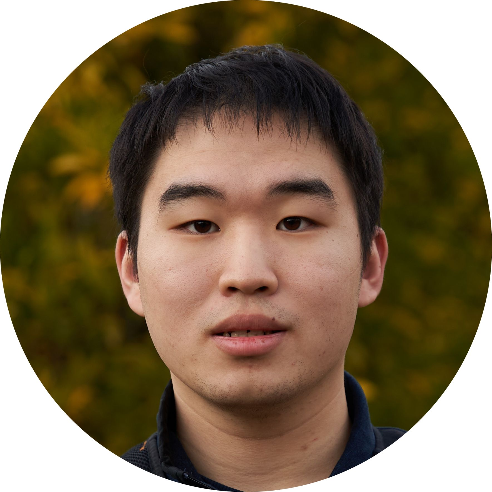

[LinkedIn](https://www.linkedin.com/in/tsengalb/) | [Google Scholar](https://scholar.google.com/citations?user=xGo0C5UAAAAJ) | albert (at) cs.cornell.edu

\

| | |
|------|--|
| I am a second year PhD student in the CS Department at Cornell advised by Chris De Sa. My research focuses on geometrically motivated methods toward efficient machine learning. Previously, I worked on autonomous last-mile delivery vehicles as a ML Engineer on the ML Research team at Nuro. I recieved my BS in Computer Science with a minor in Information and Data Sciences from Caltech, where I also worked on machine learning research in Yisong Yue's group. |  |

## Research

- QuIP#: Even Better LLM Quantization with Hadamard Incoherence and Lattice Codebooks
  **Albert Tseng\***, Jerry Chee\*, Qingyao Sun, Christopher De Sa.  
  [[arXiv]](https://arxiv.org/abs/2402.04396) [[Website]](https://cornell-relaxml.github.io/quip-sharp/) [[Code]](https://github.com/Cornell-RelaxML/quip-sharp/tree/main)   

- Shadow Cones: A Generalized Framework for Partial Order Embeddings  
  Tao Yu\*, Toni J.B. Liu\*, **Albert Tseng**, Christopher De Sa.  
  *International Conference on Learning Representations (ICLR)*, May 2024.  

- Coneheads: Hierarchy Aware Attention.  
  **Albert Tseng**, Tao Yu, Toni J.B. Liu, Christopher De Sa.  
  *Advances in Neural Information Processing Systems (NeurIPS)*, December 2023.  
  
- Automatic Synthesis of Diverse Weak Supervision Sources for Behavior Analysis.  
  **Albert Tseng**, Jennifer J. Sun, Yisong Yue.  
  *IEEE Conference on Computer Vision and Pattern Recognition (CVPR)*, June 2022.
  
- Learning Calibratable Policies using Programmatic Style-Consistency.  
  Eric Zhan, **Albert Tseng**, Yisong Yue, Adith Swaminathan, Matthew Hausknecht.  
  *International Conference on Machine Learning (ICML)*, July 2020.

\* equal contribution

\
\
Last updated February 2024.